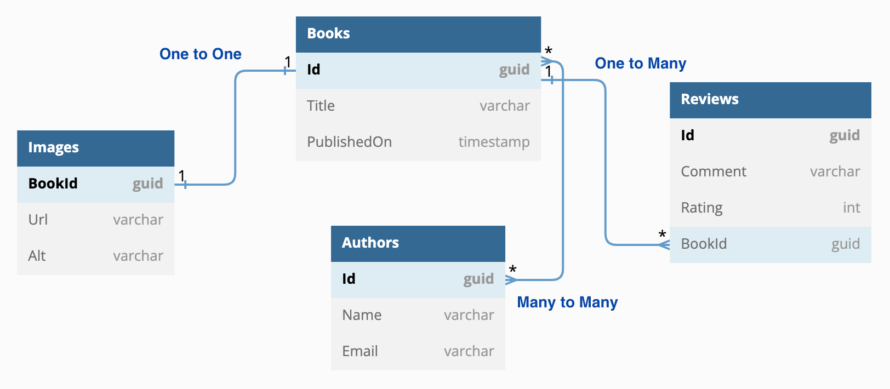
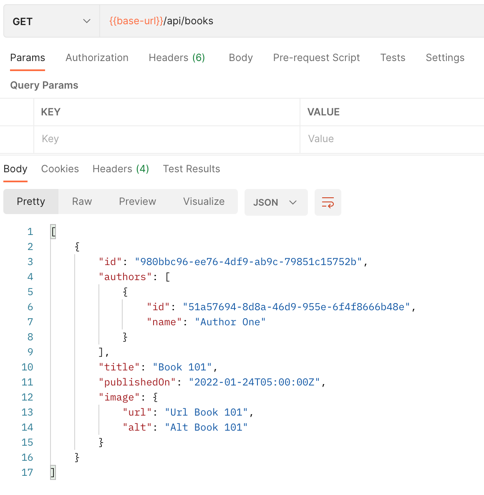
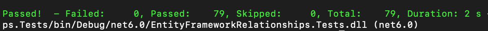
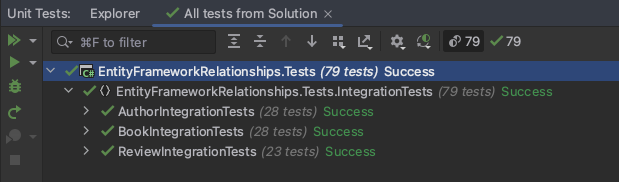

# # Entity Framework Relationships
A brief example of working with DotNet Core and Entity Framework. In this example, we are going to create a Web API to request some data. 

The data model is represented in the next image:
<p align="center">
  
</p>

### Technologies in this repo:
* DotNet Core 6
* Entity Framework 6 (Code First)
* Postgres (Docker Container)
* xUnit (Integration Tests)

## Database
We are using Postgres as the default database, but you can use any Entity Framework supported database.

#### Setup Database
Create the database container (you need to have Docker installed on your system):

```sh
docker run -d --name books-webapi-postgres -p 5432:5432 -e POSTGRES_PASSWORD=My@Passw0rd postgres
```

Stop and remove the container when needed:

```sh
docker stop my-postgres-server && docker rm my-postgres-server
```

#### Create Database

Apply the existing migration (run this command in the application root folder):

```sh
dotnet ef database update --project EntityFrameworkRelationships.Web
```

#### Add Migration

```sh
dotnet ef migrations add "InitialMigration" --project EntityFrameworkRelationships.Web
```

#### Data Seed

To add initial data just uncomment this line in Program.cs:

```cs
// DataHelper.Seed(app);
```


## Run and test the application
Run the application and make sure it's listening on port 7161.

Open postman and add a new GET request to get the default data over this url https://localhost:7161/api/books.
<p align="center">
  
</p>

## Integrations Tests (xUnit)
I have added some integration tests in the EntityFrameworkRelationships.Tests project. To run all the tests just run this command in the application root folder:

```sh
dotnet test
```
<p align="center">
  
</p>

Or run the tests with Visual Studio or Rider
<p align="center">
  
</p>